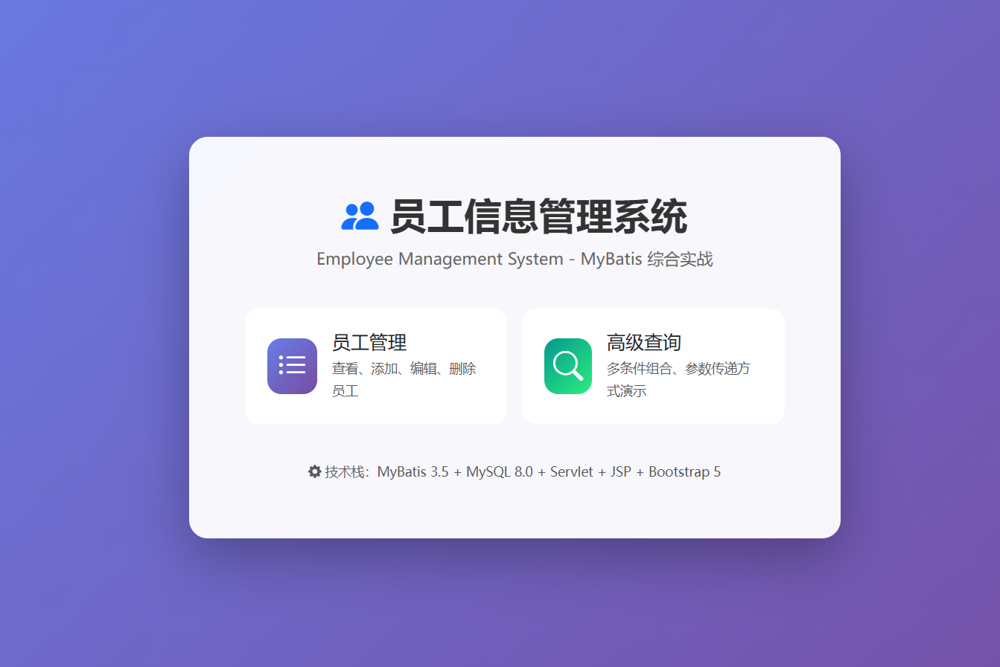

# 🏢 员工信息管理系统 (Employee Management System)

> 基于 MyBatis 框架的综合实战练习项目，涵盖 CRUD、参数传递、ResultMap 映射、动态 SQL 等核心知识点。


---

## 📋 项目简介

本项目是一个完整的 **员工信息管理系统**，使用 MyBatis 作为持久层框架，Servlet + JSP 作为 Web 层，Bootstrap 5 构建美观的前端界面。项目包含 **4 道编程题** 的完整实现，覆盖了 MyBatis 的核心功能。

### 🎯 学习目标

- ✅ MyBatis 环境搭建与配置
- ✅ 基础 CRUD 操作
- ✅ 多种参数传递方式（@Param、Map、实体类）
- ✅ ResultMap 自定义映射
- ✅ 动态 SQL（if、where、set、foreach）
- ✅ Web 应用整合开发

---

## 🛠️ 技术栈

| 技术 | 版本 | 说明 |
|------|------|------|
| Java | 8+ | 开发语言 |
| MyBatis | 3.5.13 | ORM 持久层框架 |
| MySQL | 8.0 | 关系型数据库 |
| Servlet | 4.0 | Web 层控制器 |
| JSP | 2.3 | 视图层模板 |
| JSTL | 1.2 | JSP 标准标签库 |
| Bootstrap | 5.3 | 前端 UI 框架 |
| Bootstrap Icons | 1.10.5 | 图标库 |
| Maven | 3.6+ | 项目构建工具 |
| JUnit | 4.13.2 | 单元测试框架 |
| Logback | 1.2.12 | 日志框架 |

---

## 📁 项目结构

```
employee-management/
├── pom.xml                                          # Maven 配置文件
├── README.md                                        # 项目说明文档
├── sql/
│   └── init.sql                                     # 数据库初始化脚本
└── src/
    ├── main/
    │   ├── java/com/example/
    │   │   ├── entity/
    │   │   │   └── Employee.java                    # 员工实体类
    │   │   ├── mapper/
    │   │   │   └── EmployeeMapper.java              # Mapper 接口（14个方法）
    │   │   ├── util/
    │   │   │   └── MyBatisUtil.java                 # SqlSession 工具类
    │   │   ├── filter/
    │   │   │   └── CharacterEncodingFilter.java     # UTF-8 编码过滤器
    │   │   └── servlet/
    │   │       └── EmployeeServlet.java             # Servlet 控制器
    │   ├── resources/
    │   │   ├── mybatis-config.xml                   # MyBatis 全局配置
    │   │   ├── db.properties                        # 数据库连接配置
    │   │   ├── logback.xml                          # 日志配置
    │   │   └── mapper/
    │   │       └── EmployeeMapper.xml               # SQL 映射文件
    │   └── webapp/
    │       ├── index.jsp                            # 首页
    │       └── WEB-INF/
    │           ├── web.xml                          # Web 应用配置
    │           └── views/
    │               ├── list.jsp                     # 员工列表页
    │               ├── add.jsp                      # 添加员工页
    │               ├── edit.jsp                     # 编辑员工页
    │               ├── detail.jsp                   # 员工详情页
    │               ├── queryResult.jsp              # 查询结果页
    │               └── dynamicQuery.jsp             # 高级查询中心
    └── test/java/com/example/
        └── EmployeeMapperTest.java                  # 单元测试类（14个测试）
```

---

## 🚀 快速开始

### 1. 环境要求

- **JDK** 8 或更高版本
- **Maven** 3.6 或更高版本
- **MySQL** 5.7 或更高版本
- **IDE**（推荐 IntelliJ IDEA 或 Eclipse）

### 2. 克隆项目

```bash
git clone https://github.com/your-username/employee-management-system.git
cd employee-management-system
```

### 3. 初始化数据库

```bash
# 登录 MySQL
mysql -u root -p

# 执行初始化脚本（会自动创建数据库和表，并插入测试数据）
source sql/init.sql
```

或者直接在命令行执行：

```bash
mysql -u root -p < sql/init.sql
```

### 4. 修改数据库配置

编辑 [`src/main/resources/db.properties`](src/main/resources/db.properties) 文件，修改数据库连接信息：

```properties
jdbc.driver=com.mysql.cj.jdbc.Driver
jdbc.url=jdbc:mysql://localhost:3306/employee_db?useSSL=false&serverTimezone=Asia/Shanghai&characterEncoding=utf8
jdbc.username=root
jdbc.password=123456
```

### 5. 启动项目

**方式一：使用 Maven Tomcat 插件（推荐）**

```bash
mvn tomcat7:run
```

等待看到 `Starting ProtocolHandler ["http-bio-8080"]` 后，在浏览器访问：

```
http://localhost:8080/
```

**方式二：打包为 WAR 文件部署**

```bash
mvn clean package
```

将生成的 `target/employee-management-1.0-SNAPSHOT.war` 文件复制到 Tomcat 的 `webapps` 目录下，启动 Tomcat 即可。

### 6. 运行单元测试

```bash
mvn test
```

---

## 📝 功能说明

### 🏠 首页

访问 `http://localhost:8080/`，展示系统功能入口，包含员工管理和高级查询两个主要功能模块。

### 📊 第 1 题：基础 CRUD 功能

| 功能 | 说明 | 实现方法 |
|------|------|----------|
| 根据 ID 查询 | 查询指定员工信息 | `selectById(Integer id)` |
| 添加员工 | 新增员工并返回自增主键 | `insert(Employee employee)` |
| 修改员工 | 根据 ID 更新员工信息 | `updateById(Employee employee)` |
| 删除员工 | 根据 ID 删除员工记录 | `deleteById(Integer id)` |
| 查询所有 | 获取全部员工列表 | `selectAll()` |

**关键代码示例：**

```xml
<!-- 添加员工并返回自增主键 -->
<insert id="insert" parameterType="Employee" useGeneratedKeys="true" keyProperty="id">
    INSERT INTO employee (emp_name, emp_age, emp_gender, emp_email, emp_dept)
    VALUES (#{empName}, #{empAge}, #{empGender}, #{empEmail}, #{empDept})
</insert>
```

### 🔍 第 2 题：多种参数传递方式

#### 2.1 @Param 注解传参

```java
// Mapper 接口
List<Employee> selectByNameAndDept(@Param("empName") String empName, @Param("empDept") String empDept);
```

```xml
<!-- XML 映射 -->
<select id="selectByNameAndDept" resultType="Employee">
    SELECT * FROM employee
    WHERE emp_name = #{empName} AND emp_dept = #{empDept}
</select>
```

#### 2.2 Map 传参

```java
// Mapper 接口
List<Employee> selectByAgeAndGender(Map<String, Object> params);
```

```xml
<!-- XML 映射 -->
<select id="selectByAgeAndGender" parameterType="map" resultType="Employee">
    SELECT * FROM employee
    WHERE emp_age > #{empAge} AND emp_gender = #{empGender}
</select>
```

#### 2.3 实体类传参

```java
// Mapper 接口
List<Employee> selectByNameLike(Employee employee);
```

```xml
<!-- XML 映射 -->
<select id="selectByNameLike" parameterType="Employee" resultType="Employee">
    SELECT * FROM employee
    WHERE emp_name LIKE CONCAT('%', #{empName}, '%')
</select>
```

### 🗺️ 第 3 题：ResultMap 自定义映射

当数据库字段（下划线命名）与实体类属性（驼峰命名）不一致时，使用 `<resultMap>` 进行手动映射：

```xml
<!-- 自定义 ResultMap -->
<resultMap id="employeeResultMap" type="Employee">
    <id property="id" column="id"/>
    <result property="empName" column="emp_name"/>
    <result property="empAge" column="emp_age"/>
    <result property="empGender" column="emp_gender"/>
    <result property="empEmail" column="emp_email"/>
    <result property="empDept" column="emp_dept"/>
</resultMap>

<!-- 使用 ResultMap 查询 -->
<select id="selectByIdWithResultMap" parameterType="int" resultMap="employeeResultMap">
    SELECT * FROM employee WHERE id = #{id}
</select>
```

### ⚡ 第 4 题：动态 SQL 综合实现

#### 4.1 多条件组合查询（`<where>` + `<if>`）

```xml
<select id="selectByCondition" parameterType="Employee" resultType="Employee">
    SELECT * FROM employee
    <where>
        <if test="empName != null and empName != ''">
            AND emp_name LIKE CONCAT('%', #{empName}, '%')
        </if>
        <if test="empAge != null">
            AND emp_age = #{empAge}
        </if>
        <if test="empGender != null and empGender != ''">
            AND emp_gender = #{empGender}
        </if>
        <if test="empDept != null and empDept != ''">
            AND emp_dept = #{empDept}
        </if>
    </where>
</select>
```

#### 4.2 动态更新（`<set>` + `<if>`）

```xml
<update id="updateDynamic" parameterType="Employee">
    UPDATE employee
    <set>
        <if test="empName != null and empName != ''">
            emp_name = #{empName},
        </if>
        <if test="empAge != null">
            emp_age = #{empAge},
        </if>
        <if test="empGender != null and empGender != ''">
            emp_gender = #{empGender},
        </if>
        <if test="empEmail != null and empEmail != ''">
            emp_email = #{empEmail},
        </if>
        <if test="empDept != null and empDept != ''">
            emp_dept = #{empDept},
        </if>
    </set>
    WHERE id = #{id}
</update>
```

#### 4.3 批量删除（`<foreach>`）

```xml
<delete id="deleteByIds" parameterType="list">
    DELETE FROM employee
    WHERE id IN
    <foreach collection="list" item="id" open="(" separator="," close=")">
        #{id}
    </foreach>
</delete>
```

---

## 🖥️ 页面展示

### 首页
渐变背景设计，提供员工管理和高级查询两个功能入口。

### 员工列表页
- 🔍 多条件组合搜索栏（姓名、部门、性别、年龄）
- 📊 数据表格展示（支持全选/批量删除）
- ✏️ 编辑、查看详情、删除操作按钮
- 💡 操作成功提示消息

### 高级查询中心
展示 6 种不同的查询方式，每种查询都有独立的卡片界面：
1. @Param 多参数查询
2. Map 传参查询
3. 实体类传参查询
4. ResultMap 映射查询
5. 动态多条件查询
6. 动态更新

---

## 🧪 测试说明

项目包含完整的单元测试，覆盖所有 4 道编程题的功能：

```bash
# 运行所有测试
mvn test

# 运行指定测试方法
mvn test -Dtest=EmployeeMapperTest#testSelectById
```

### 测试用例列表

| 测试方法 | 测试内容 |
|----------|----------|
| `testSelectById` | 根据 ID 查询员工 |
| `testInsert` | 添加员工并验证自增主键 |
| `testUpdateById` | 修改员工信息 |
| `testDeleteById` | 删除员工 |
| `testSelectAll` | 查询所有员工 |
| `testSelectByNameAndDept` | @Param 多参数查询 |
| `testSelectByAgeAndGender` | Map 传参查询 |
| `testSelectByNameLike` | 实体类模糊查询 |
| `testSelectByIdWithResultMap` | ResultMap 映射查询 |
| `testSelectByCondition` | 动态多条件查询 |
| `testUpdateDynamic` | 动态更新 |
| `testDeleteByIds` | 批量删除 |

---

## 📦 数据库设计

### employee 表结构

| 字段名 | 类型 | 约束 | 说明 |
|--------|------|------|------|
| id | INT | PRIMARY KEY, AUTO_INCREMENT | 员工 ID |
| emp_name | VARCHAR(20) | NOT NULL | 员工姓名 |
| emp_age | INT | - | 员工年龄 |
| emp_gender | CHAR(1) | - | 性别（M/F） |
| emp_email | VARCHAR(50) | - | 邮箱 |
| emp_dept | VARCHAR(30) | - | 部门 |

### 测试数据

初始化脚本会自动插入 8 条测试数据：

| ID | 姓名 | 年龄 | 性别 | 邮箱 | 部门 |
|----|------|------|------|------|------|
| 1 | 张三 | 28 | 男 | zhangsan@example.com | 技术部 |
| 2 | 李四 | 32 | 女 | lisi@example.com | 市场部 |
| 3 | 王五 | 25 | 男 | wangwu@example.com | 技术部 |
| 4 | 赵六 | 30 | 女 | zhaoliu@example.com | 人事部 |
| 5 | 孙七 | 27 | 男 | sunqi@example.com | 财务部 |
| 6 | 周八 | 35 | 男 | zhouba@example.com | 技术部 |
| 7 | 吴九 | 24 | 女 | wujiu@example.com | 市场部 |
| 8 | 郑十 | 29 | 男 | zhengshi@example.com | 人事部 |

---

## 🔧 配置说明

### MyBatis 配置（mybatis-config.xml）

```xml
<settings>
    <!-- 开启驼峰命名自动映射：emp_name -> empName -->
    <setting name="mapUnderscoreToCamelCase" value="true"/>
    <!-- 开启 SLF4J 日志 -->
    <setting name="logImpl" value="SLF4J"/>
</settings>
```

### 数据库配置（db.properties）

```properties
jdbc.driver=com.mysql.cj.jdbc.Driver
jdbc.url=jdbc:mysql://localhost:3306/employee_db?useSSL=false&serverTimezone=Asia/Shanghai&characterEncoding=utf8
jdbc.username=root
jdbc.password=123456
```

---

## 📚 MyBatis 知识点总结

### 参数传递方式

| 方式 | 适用场景 | 示例 |
|------|----------|------|
| `@Param` 注解 | 多个简单参数 | `selectByNameAndDept(@Param("name") String name, @Param("dept") String dept)` |
| `Map` 集合 | 参数数量不确定 | `selectByAgeAndGender(Map<String, Object> params)` |
| 实体类对象 | 参数较多且属于同一实体 | `selectByNameLike(Employee employee)` |

### 动态 SQL 标签

| 标签 | 作用 | 使用场景 |
|------|------|----------|
| `<if>` | 条件判断 | 根据条件决定是否包含某段 SQL |
| `<where>` | 智能 WHERE | 自动处理 AND/OR 前缀，去除多余关键字 |
| `<set>` | 智能 SET | 自动处理 UPDATE 语句中的逗号 |
| `<foreach>` | 循环遍历 | 批量操作（IN 查询、批量插入、批量删除） |

### 结果映射

| 方式 | 说明 | 适用场景 |
|------|------|----------|
| `resultType` | 自动映射 | 字段名与属性名一致，或开启驼峰命名转换 |
| `resultMap` | 手动映射 | 字段名与属性名不一致，需要精确控制映射关系 |

---

## 🤝 贡献指南

欢迎提交 Issue 和 Pull Request！

1. Fork 本仓库
2. 创建你的特性分支 (`git checkout -b feature/AmazingFeature`)
3. 提交你的更改 (`git commit -m 'Add some AmazingFeature'`)
4. 推送到分支 (`git push origin feature/AmazingFeature`)
5. 打开一个 Pull Request

---

## 📄 许可证

本项目基于 MIT 许可证开源 - 详见 [LICENSE](LICENSE) 文件

---

## 👨‍💻 作者

- **Your Name** - [GitHub](https://github.com/your-username)

---

## 🙏 致谢

- [MyBatis 官方文档](https://mybatis.org/mybatis-3/zh/index.html)
- [Bootstrap 官方文档](https://getbootstrap.com/docs/5.3/)
- [MySQL 官方文档](https://dev.mysql.com/doc/)

---

## 📸 项目截图

> 💡 **提示**：运行项目后，访问 http://localhost:8080/ 查看完整界面效果

### 首页


### 员工列表


### 添加员工


### 高级查询中心


---

⭐ 如果这个项目对你有帮助，请给个 Star 支持一下！
